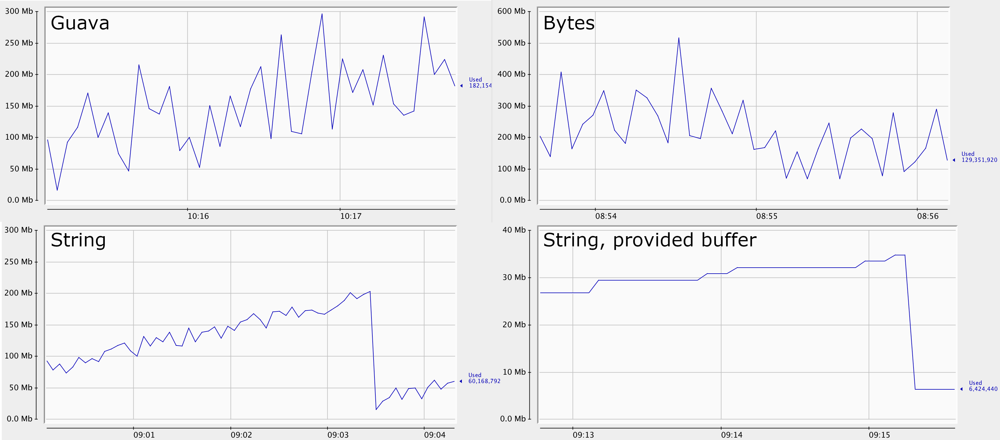

[](http://unlicense.org/)
[](https://travis-ci.com/eprst/murmur3)

Fast Murmur3 hash implementation for Java, mostly a fork of
[yonik](https://github.com/yonik/java_util) work with
String-optimized 128-bit implementation added. See [blog post](http://yonik.com/murmurhash3-for-java/)
about the original verion.

There are 3 128-bit versions provided:
- `murmurhash3_x64_128` which takes a byte buffer to hash
- `murmurhash3_x64_128` which takes a `CharSequence` and treats it as a UTF-8 encoded string. It doesn't
make a [quite expensive](http://www.evanjones.ca/software/java-string-encoding-internals.html) call to
`String.getBytes` and decodes small chunks on the go instead. It runs in constant memory and uses a 19 element
byte buffer which can be provided by the caller to avoid any allocations. See memory charts below for a  difference
in memory consumption
- `murmurhash3_x64_128_ascii` which takes a `CharSequence` and treats it as UTF-8 encoded string with
ASCII characters only. Has zero allocations and provides a significant performance boost.

There are no checks made around string decoding operations, so wrong hashes will be generated if a non-ASCII characters
are passed to `murmurhash3_x64_128_ascii` or if `murmurhash3_x64_128` receives an illegal UTF-8 string, no errors will be
raised. 

# Performance
Here are results for 128-bit hash on my laptop, run `./gradlew jmh` to reproduce. One point is given for
hashing 100 random strings, so a score of `38820` for example means 3.8M hashes/sec.

- `guava` uses `com.google.common.hash.Hashing.murmur3_128(0).hashString()`
- `murmur*Bytes` uses `murmurhash3_x64_128` passing `s.getBytes(StandardCharsets.UTF_8)`
- `murmur*String` calls `murmurhash3_x64_128` passing a string directly, it also reuses the 19-byte buffer
- `murmurAsciiOptimizedString` calls `murmurhash3_x64_128_ascii`


ACSCII (1-128 characters strings)
```
Benchmark                                   Mode  Cnt       Score      Error  Units
BenchString128.guavaAscii                  thrpt  100   38820.061 ±  767.128  ops/s
BenchString128.murmurAsciiBytes            thrpt  100   79370.216 ± 1014.949  ops/s
BenchString128.murmurAsciiString           thrpt  100   83249.135 ±  521.336  ops/s
BenchString128.murmurAsciiOptimizedString  thrpt  100  155105.622 ± 1984.475  ops/s
```

Unicode (1-64 character strings)
```
Benchmark                            Mode  Cnt      Score     Error  Units
BenchString128.guavaUnicode         thrpt  100  22044.362 ± 228.743  ops/s
BenchString128.murmurUnicodeBytes   thrpt  100  32272.569 ± 635.764  ops/s
BenchString128.murmurUnicodeString  thrpt  100  36704.326 ± 237.645  ops/s
```

# Memory usage
Here are memory usage charts by different versions.



- `Guava` is `com.google.common.hash.Hashing.murmur3_128(0).hashString()`
- `Bytes` is `murmurhash3_x64_128` receiving `s.getBytes(StandardCharsets.UTF_8)`
- `String` is `murmurhash3_x64_128` getting a string directly and having to allocate `buf19` on every call
- `String, providede buffer` is `murmurhash3_x64_128` getting a string directly, reusing `buf19`

# Using
Simply copy to your project or get from
[maven central](https://search.maven.org/artifact/com.github.eprst/murmur3/0.3/jar).
